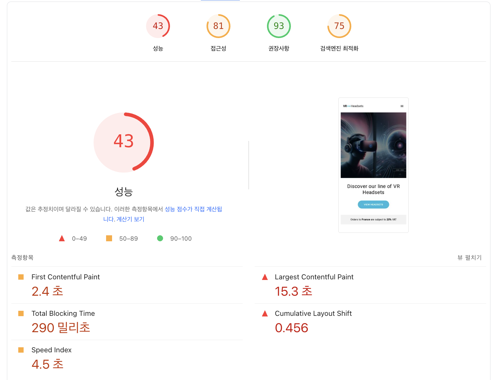
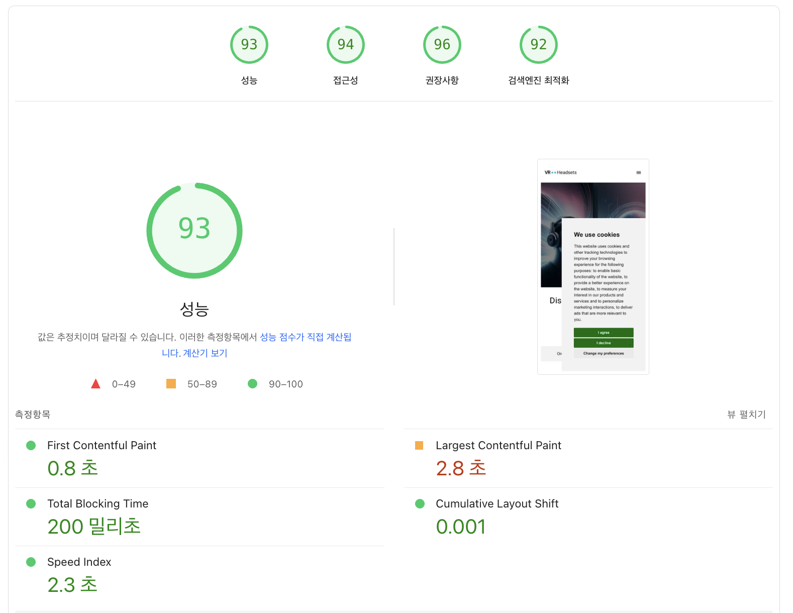
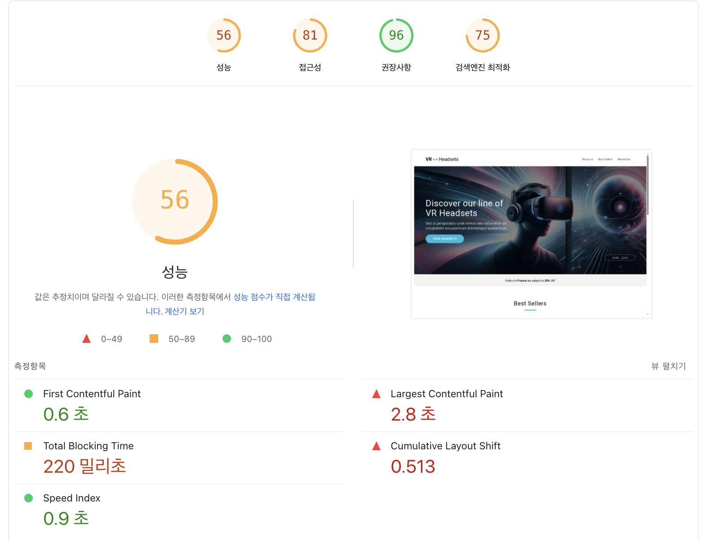
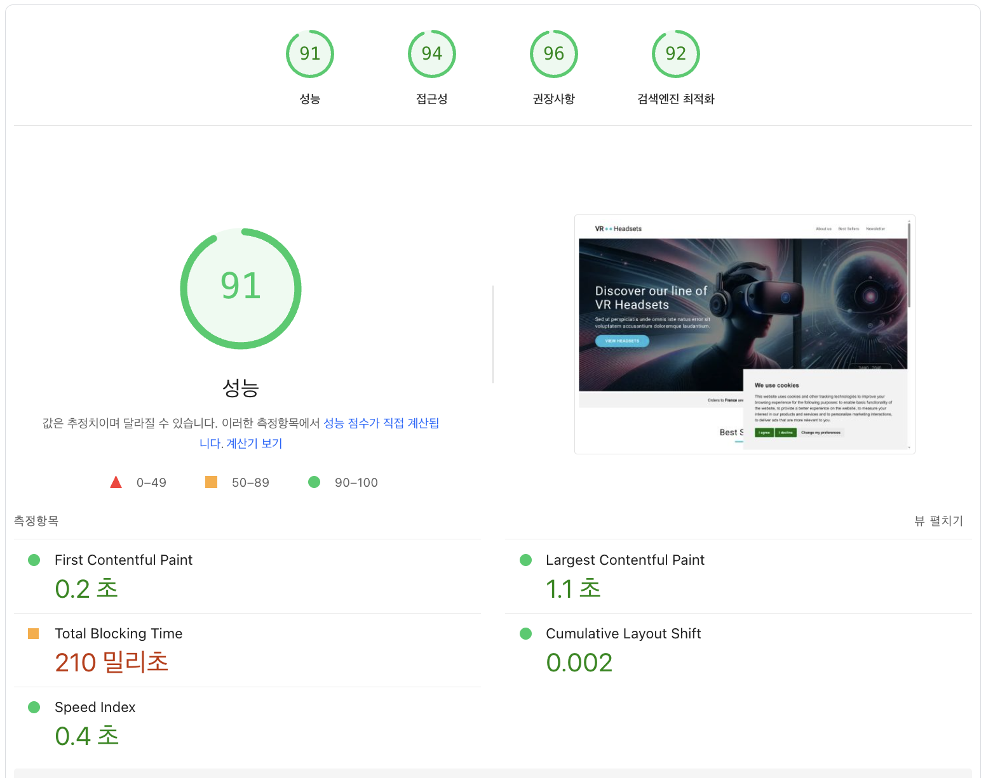

# 바닐라 JS 프로젝트 성능 개선
URL : https://front-5th-chapter4-2-basic-roan.vercel.app/

## 개선 전 후 비교

### Light House 비교

| 항목(영문) | **최적화 전** (모바일, 4G, CPU ×4 슬로틀링) | **최적화 후** (동일 조건) | 비교 |
|-----------|-----------------------------------------------|--------------------------------|--------|
| **Lighthouse 점수** |||||  
| Performance (성능) | **43 점** | **93 점** | **▲ +50** |
| Accessibility (접근성) | 81 점 | 94 점 | ▲ +13 |
| Best Practices (권장사항) | 93 점 | 96 점 | ▲ +3 |
| SEO | 75 점 | 92 점 | ▲ +17 |
| **Core Web Vitals, 지표** |||||  
| First Contentful Paint (FCP)| 2.4 초 | **0.8 초** | ▼ –1.6 s |
| Largest Contentful Paint (LCP)| 15.3 초 | **2.8 초** | ▼ –12.5 s |
| Total Blocking Time (TBT) | 290 밀리초 | **200 밀리초** | ▼ –90 ms |
| Speed Index  | 4.5 초 | **2.3 초** | ▼ –2.2 s |
| Cumulative Layout Shift (CLS) | 0.456 | **0.001** | ▼ –0.455 |

- Performance 점수는 **43 → 93(+50)**으로 대폭 개선되었습니다.
- LCP는 12초 이상 단축되었습니다.
- CLS는 0.456 → 0.001로 감소하여 사용자가 체감할 정도의 레이아웃 움직임이나 글자 깜박임이 개선되었습니다.
- 접근성·SEO 부문도 각각 90점대를 달성해 전반적인 웹 성능 지표가 향상되었습니다.

## 🚨 웹사이트 성능 개선 전

> 📅 측정 시간: 2025. 6. 2. 오후 1:41:37

### 🎯 Lighthouse 점수
| 카테고리 | 점수 | 상태 |
|----------|------|------|
| Performance | 72% | 🟠 |
| Accessibility | 82% | 🟠 |
| Best Practices | 75% | 🟠 |
| SEO | 82% | 🟠 |
| PWA | 0% | 🔴 |

### 📊 Core Web Vitals (2024)
| 메트릭 | 설명 | 측정값 | 상태 |
|--------|------|--------|------|
| LCP | Largest Contentful Paint | 14.56s | 🔴 |
| INP | Interaction to Next Paint | N/A | 🟢 |
| CLS | Cumulative Layout Shift | 0.011 | 🟢 |

## 🚨 웹사이트 성능 개선 후
> 📅 측정 시간: 2025. 6. 4. 오후 8:24:07

### 🎯 Lighthouse 점수
| 카테고리 | 점수 | 상태 |
|----------|------|------|
| Performance | 99% | 🟢 |
| Accessibility | 95% | 🟢 |
| Best Practices | 96% | 🟢 |
| SEO | 100% | 🟢 |
| PWA | 0% | 🔴 |

### 📊 Core Web Vitals (2024)
| 메트릭 | 설명 | 측정값 | 상태 |
|--------|------|--------|------|
| LCP | Largest Contentful Paint | 2.11s | 🟢 |
| INP | Interaction to Next Paint | N/A | 🟢 |
| CLS | Cumulative Layout Shift | N/A | 🟢 |

### Page Speed Insights 비교

https://pagespeed.web.dev/ 에서 비교한 수치

- 모바일 개선 [전](https://pagespeed.web.dev/analysis/https-front-5th-chapter4-2-basic-roan-vercel-app/2rw3wf5wz2?form_factor=mobile) | [후](https://pagespeed.web.dev/analysis/https-front-5th-chapter4-2-basic-roan-vercel-app/ciiaqeojsy?form_factor=mobile)
- 데스크탑 개선 [전](https://pagespeed.web.dev/analysis/https-front-5th-chapter4-2-basic-roan-vercel-app/2rw3wf5wz2?form_factor=desktop)|[후](https://pagespeed.web.dev/analysis/https-front-5th-chapter4-2-basic-roan-vercel-app/ciiaqeojsy?form_factor=desktop)
---
|| 개선 전 | 개선 후( 이미지 변경 예정 )|
|----|-----|-----|
|모바일|||
|데스크탑|||

## 최적화 할 수 있는 것들

- 이미지 리소스 최적화 (layout 관련, 이미지 사이즈 명시 및 해상도 낮추기)
- js, css 로딩 최적화 (화면에 보이는 것 위주로 랜더링 시키기)
- 폰트
- 불필요한 요청 제거하기
- 이벤트 관리
- 애니메이션

### 지표로 확인하기

| 지표                                 | 측정치        | 목표치\*    | 상태 | 우선도   |
| ---------------------------------- | ---------- | -------- | -- | ----- |
| **Largest Contentful Paint (LCP)** | **15.8 s** | ≤ 2.5 s  | 심각 | **1** |
| **Cumulative Layout Shift (CLS)**  | **0.526**  | ≤ 0.10   | 심각 | **1** |
| **Total Blocking Time (TBT)**      | **310 ms** | ≤ 200 ms | 주의 | **2** |
| First Contentful Paint (FCP)       | 2.4 s      | ≤ 1.8 s  | 보통 | 3     |
| Speed Index                        | 2.9 s      | ≤ 3.4 s  | 양호 | 4     |

*목표치는 Core Web Vitals 권장 기준.

## 용어와 수치로 최적화 부분 이해하기

### 용어 이해하기 
| 지표 용어                                  | Core Web Vitals 포함 여부 | 정의                                                        | 사용자가 체감하는 문제                 |
| ----------------------------------- | --------------------- | --------------------------------------------------------- | ---------------------------- |
| **LCP (Largest Contentful Paint)**  | ✅                     | 뷰포트 안에서 **가장 큰 이미지 또는 블록 텍스트**가 렌더링 완료되는 시간               | “주요 화면이 뜨는데 왜 이렇게 오래 걸려?”    |
| **INP (Interaction to Next Paint)** | ✅ (2024-03부터 FID 대체)  | 임의의 사용자 입력(클릭, 탭, 키 입력)에 대해 **다음 화면이 그려질 때까지 걸린 지연의 p95** | “버튼 눌렀는데 반응이 한 박자 늦네.”       |
| **CLS (Cumulative Layout Shift)**   | ✅                     | 페이지 전체 수명 동안 발생한 **예상치 못한 레이아웃 이동의 누적 합계**                | “읽던 글이 갑자기 밀려서 다른 걸 눌러 버렸어.” |
| **FCP (First Contentful Paint)**    | ❌ (참고 지표)             | 첫 번째 DOM 콘텐츠(텍스트/이미지)가 화면에 나타난 시점                         | “빈 화면이 꽤 오래 뜨네.”             |

### 1. LCP(15.8s)
Largest Contentful Paint
| 영역            | 대표 원인                | 핵심 대응책                                                                                                |
| ------------- | -------------------- | ----------------------------------------------------------------------------------------------------- |
| **네트워크 지연**   | 느린 TTFB, 무압축·대용량 이미지 | • 서버·CDN 활성화 • `next/image` + `priority` 속성으로 AVIF/WEBP 전송 • `<link rel="preload">`로 LCP 자원 선적재 |
| **렌더-블로킹 자원** | 거대한 CSS/JS 번들        | • CSS critical-inlining, `media`-쿼리 분할 • `async`/`defer` + 코드 스플리팅                                 |
| **클라이언트 연산**  | 런타임 이미지 변환·heavy JS  | • 이미지 미리-빌드, 서버 측 변환 • React lazy, dynamic import로 fold-below 컴포넌트 지연                              |

#### To Do
- LCP element(대개 히어로 이미지) 식별 → 용량·포맷 최적화 -> jpg, png파일은 webp로 변경하기
- 서버 응답 시간 측정 → TTFB > 200 ms면 API/SSR 캐시 적용
- <head> 내 preload 삽입 → 실제 LCP 개선 효과 확인 -> 폰트는 로컬에서 받아오는 형태로 변경하기

### 2. CLS (0.526)

Cumulative Layout Shift

| 패턴            | 증상             | 해결 방법                                         |
| ------------- | -------------- | --------------------------------------------- |
| 사이즈 없는 이미지·영상 | 로딩 중 영역 확보 안 됨 | `width`·`height` 속성 또는 `aspect-ratio` 지정      |
| 광고·배너 동적 삽입   | 콘텐츠 아래로 밀림     | 고정 크기 플래시 컨테이너 확보, lazy-render 대신 placeholder |
| 웹폰트 FOUT/FOIT | 글씨 교체로 이동      | `font-display: optional` or `swap` + 시스템 폰트 fallback    |
| 애니메이션 위치 이동   | `top/left` 변경  | transform 사용 (`translate`, `scale`)           |

#### To Do
- layout-shift-groups 크롬 플래그로 문제 요소 추적
- 이미지·embed 태그 일괄 폭·높이 지정 → 즉시 CLS ↓
- 배너·모달은 스크롤 하단 고정 또는 미리 자리 확보

### 3. TBT (310 ms) — 메인 스레드가 0.3 초 이상 ‘멈춤’

Total Blocking Time - 사용자가 첫 화면을 본 뒤 ‘클릭’했을 때 브라우저가 얼만큼 바쁘게 묶여 있었는지

| 원인       | 개선 방안                                                                                   |
| -------- | --------------------------------------------------------------------------------------- |
| 번들 크기 과다 | • webpack/rollup 분석 → lodash, moment 등 제거·tree-shake • React 19 `use` API + 스트리밍 SSR |
| 동기 JS 로직 | • 비필수 로직 `requestIdleCallback` 이동 • heavy 계산 Web Worker 분리                           |
| 제3자 스크립트 | • 태그 매니저 지연 로딩·서버 측 삽입 • A/B 테스트·애널리틱스 async 처리                                      |
### 4. FCP·기타
- Critical CSS inlining 후 폰트·아이콘은 preconnect + dns-prefetch
- 이미지·비디오 loading="lazy" + fetchpriority="high" 병행
- HTTP/2 또는 3 활성화, 압축(Br, Gzip) 확인

## 최적화한 부분과 알게된 점 정리

### 1. 이미지 최적화
- alt 속성 추가 – 접근성 및 SEO 점수 높히기
- width·height 지정 – CLS(누적 레이아웃 이동)를 방지하기
  - <picture> 태그로 교체해도 width·height 지정하지 않으면 CLS가 떨어짐
- JPEG → WebP 전환 – 동일 해상도 대비 파일 크기 평균 25~35 % 절감.
- 작은 아이콘은 SVG로 대체 (126 B PNG의 경우 WebP로 바꿔도 절감 폭이 미미하다고 생각함)
- SVG는 해상도 독립적·CSS로 직접 스타일링 가능해 유지보수성이 우수합니다.
- <picture> 태그로 반응형 적용 + sizes 지정 – 기기별 다운로드 바이트를 최적화하기
- `decoding="async"`, `fetchpriority="high"`
  - decoding="async"은 이미지 디코딩을 메인 스레드에서 비동기화해 첫 페인트 지연을 줄이기
  - fetchpriority="high"(Chrome 96 +)는 LCP 후보 이미지를 가장 먼저 다운로드되게하기

### 2.스크립트 로딩 최적화

- 당장 렌더링이 필요하지 않은 script 태그(쿠키 배너 등등)에는 defer 속성을 추가해 첫 렌더링 속도를 개선했습니다. – HTML 파싱과 병렬 다운로드 가능 → LCP 개선.
- img 태그를 picture태그로 반응형을 적용하면서 추가했던 서드파티 polyfill(picturefill) 제거하였습니다. - 최신 브라우저 타깃이라면 불필요한 JS 2 ~ 5 kB와 평가 비용을 줄이기

### 3. 폰트 최적화
- 외부 호스팅 → 로컬 서빙으로 변경
- TTF → WOFF2·WOFF 변환 – 압축률 향상(최대 40 %↓)
- `@font-face` + `font-display: swap` – 네트워크 문제로 폰트가 지연되더라도 시스템 폰트로 먼저 넥스트를 보여줄 수 있도록 하였습니다. → FOIT(Flash of Faux Text) 방지
  - `font-display: swap` 텍스트 숨김 문제는 해결하지만 시스템 폰트 사이즈가 달라 레이아웃이 이동되는 문제까지는 해결하지 못해 어느 정도 시스템의 폰트 간격과 사이즈가 맞춰야한다는 점을 알게되었습니다.
- preload를 추가하여 폰트가 우선 로드될 수 있도록 하였습니다. – LCP 영역 텍스트 폰트를 <head>에서 사전 로드
- preconnect + crossorigin 속성을 주어 폰트 파일을 CORS-compatible 모드로 요청해 두 번 내려받는 일을 방지하였습니다. – 외부 호스트 TLS 핸드셰이크 1 RTT 감소
  - preconnect 시 crossorigin을 빼면 브라우저가 CORS 옵션 요청을 추가로 보내 다시 RTT가 늘어날 수 있다는 점을 알게되었습니다.
  - 시스템 폰트 Fallback 이후 실제 커스텀 폰트가 적용될 때 예상치 못한 레이아웃 리플로우가 발생할 수 있다는 것을 알게되었습니다. 주요 상단에 보이는 텍스트일 경우 FOFT(Flash of Faux Text) 회피 기준으로 디자인 글자폭을 확인해야 합니다.

### 4. 메타태그 추가하기

- 해당 사이트의 목적을 바로 알 수 있게하기 위해 meta태그로 description과 http-equiv를 추가하였습니다.

#### 추가 정리
- TTF는 범용 OS, 문서용에 적합하지만 인쇄용 벡터 폰트로 거의 모든 환경에서 인식되는 반면 압축된 폰트가 아니라 용량이 큽니다.
- WOFF (Web Open Font Format) 는 TTF/OTF를 zlib으로 압축하고 라이선스 메타데이터를 추가한 웹 전용 패키지로, 파일 크기가 줄어 TTF보다 로딩이 빨라집니다.
- WOFF2 — WOFF의 후속 규격으로 Brotli 압축을 적용해 WOFF 대비 약 20-30 % 더 용량을 절약할 수 있습니다.