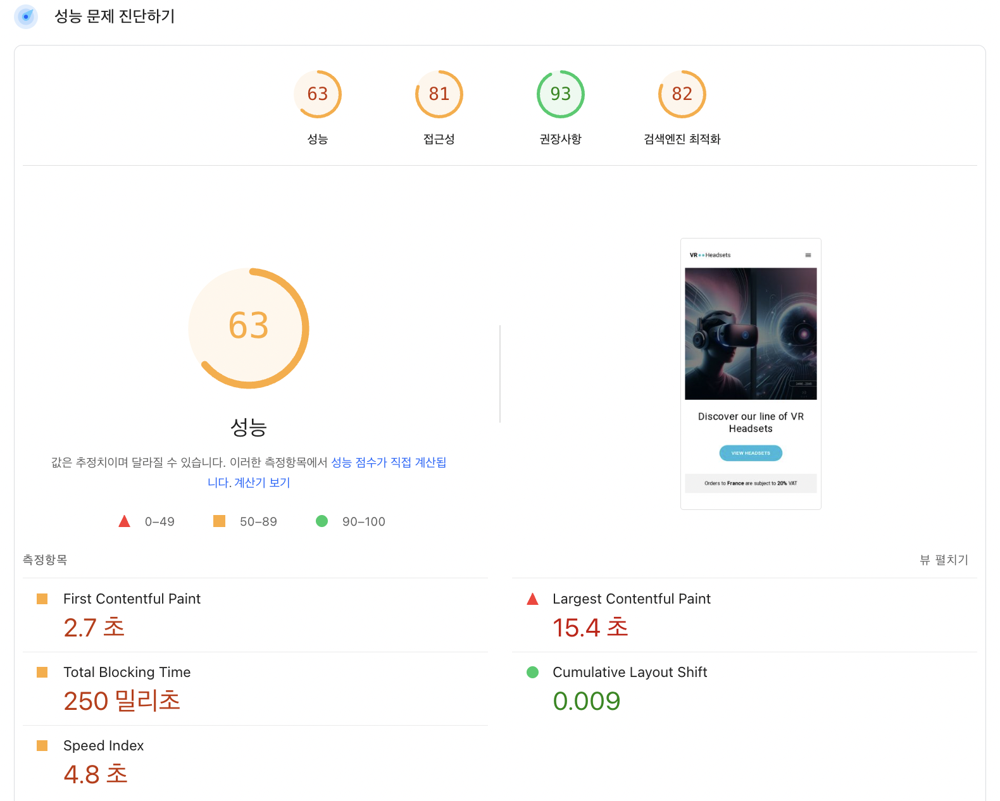
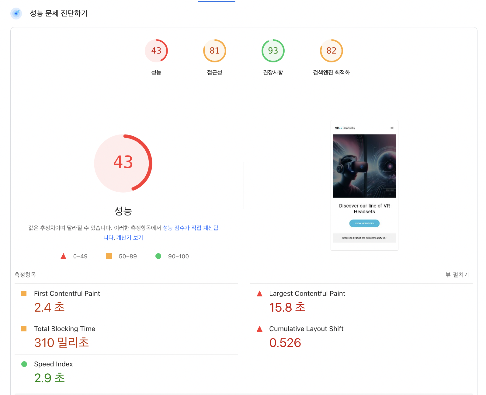

https://front-5th-chapter4-2-basic-seven.vercel.app/

## 개선 전 후 비교
https://pagespeed.web.dev/ 에서 비교한 수치
|URL| 개선 전 | 개선 후( 이미지 변경 예정 )|
|----|-----|-----|
|https://front-5th-chapter4-2-basic-js0pmnv15-devchaeyoungs-projects.vercel.app/|||
|https://front-5th-chapter4-2-basic-seven.vercel.app/|||

### 개선이 되어야하는 부분

수치는 도메인 https://front-5th-chapter4-2-basic-seven.vercel.app 기준으로 잡았습니다.
| 지표                                 | 측정치        | 목표치\*    | 상태 | 우선도   |
| ---------------------------------- | ---------- | -------- | -- | ----- |
| **Largest Contentful Paint (LCP)** | **15.8 s** | ≤ 2.5 s  | 심각 | **1** |
| **Cumulative Layout Shift (CLS)**  | **0.526**  | ≤ 0.10   | 심각 | **1** |
| **Total Blocking Time (TBT)**      | **310 ms** | ≤ 200 ms | 주의 | **2** |
| First Contentful Paint (FCP)       | 2.4 s      | ≤ 1.8 s  | 보통 | 3     |
| Speed Index                        | 2.9 s      | ≤ 3.4 s  | 양호 | 4     |
*목표치는 Core Web Vitals 권장 기준.
> 현재 가장 큰 병목은 LCP 지연과 레이아웃 시프트입니다. 이미지 최적화·preload,레이아웃 공간 확보만으로도 점수가 70대까지 빠르게 개선될 가능성이 높습니다. 그 이후 JS 최적화(TBT)와 서버 TTFB 개선을 병행하면 90점대도 충분히 달성 가능합니다.

## 개선 우선 순위
### 1. LCP(15.8s)
| 영역            | 대표 원인                | 핵심 대응책                                                                                                |
| ------------- | -------------------- | ----------------------------------------------------------------------------------------------------- |
| **네트워크 지연**   | 느린 TTFB, 무압축·대용량 이미지 | • 서버·CDN 활성화 • `next/image` + `priority` 속성으로 AVIF/WEBP 전송 • `<link rel="preload">`로 LCP 자원 선적재 |
| **렌더-블로킹 자원** | 거대한 CSS/JS 번들        | • CSS critical-inlining, `media`-쿼리 분할 • `async`/`defer` + 코드 스플리팅                                 |
| **클라이언트 연산**  | 런타임 이미지 변환·heavy JS  | • 이미지 미리-빌드, 서버 측 변환 • React lazy, dynamic import로 fold-below 컴포넌트 지연                              |

#### To Do
- LCP element(대개 히어로 이미지) 식별 → 용량·포맷 최적화
- 서버 응답 시간 측정 → TTFB > 200 ms면 API/SSR 캐시 적용
- <head> 내 preload 삽입 → 실제 LCP 개선 효과 확인

### 2. CLS (0.526)
| 패턴            | 증상             | 해결 방법                                         |
| ------------- | -------------- | --------------------------------------------- |
| 사이즈 없는 이미지·영상 | 로딩 중 영역 확보 안 됨 | `width`·`height` 속성 또는 `aspect-ratio` 지정      |
| 광고·배너 동적 삽입   | 콘텐츠 아래로 밀림     | 고정 크기 플래시 컨테이너 확보, lazy-render 대신 placeholder |
| 웹폰트 FOUT/FOIT | 글씨 교체로 이동      | `font-display: optional` + 시스템 폰트 fallback    |
| 애니메이션 위치 이동   | `top/left` 변경  | transform 사용 (`translate`, `scale`)           |
#### To Do
- layout-shift-groups 크롬 플래그로 문제 요소 추적
- 이미지·embed 태그 일괄 폭·높이 지정 → 즉시 CLS ↓
- 배너·모달은 스크롤 하단 고정 또는 미리 자리 확보

### 3. TBT (310 ms) — 메인 스레드가 0.3 초 이상 ‘멈춤’
| 원인       | 개선 방안                                                                                   |
| -------- | --------------------------------------------------------------------------------------- |
| 번들 크기 과다 | • webpack/rollup 분석 → lodash, moment 등 제거·tree-shake • React 19 `use` API + 스트리밍 SSR |
| 동기 JS 로직 | • 비필수 로직 `requestIdleCallback` 이동 • heavy 계산 Web Worker 분리                           |
| 제3자 스크립트 | • 태그 매니저 지연 로딩·서버 측 삽입 • A/B 테스트·애널리틱스 async 처리                                      |
### 4. FCP·기타
- Critical CSS inlining 후 폰트·아이콘은 preconnect + dns-prefetch
- 이미지·비디오 loading="lazy" + fetchpriority="high" 병행
- HTTP/2 또는 3 활성화, 압축(Br, Gzip) 확인

## 목표 수치

| 지표           | 타깃 (모바일) |
| ------------ | -------- |
| LCP          | < 2.5 s  |
| INP (또는 TBT) | < 200 ms |
| CLS          | < 0.10   |
| FCP          | < 1.8 s  |

